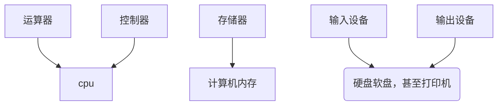

import { Image,Callout } from 'nextra/components'

## 冯诺依曼架构
+ 数学家冯·诺依曼提出了计算机制造的三个基本原则，即采用二进制逻辑、程序存储执行以及计算机由五个部分组成（运算器、控制器、存储器、输入设备[^ps1]、输出设备）
，这套理论被称为冯·诺依曼体系结构。
 
<Image src="/architecture.png" className='w-full'/>
+ 这套理论奠定了后世计算机的基础结构，五个部分也演变为了今天的

## 本章中英对照表
| 英文      | 中文 |
| ----------- | ----------- |
| long long ago | 很久很久以前    |
[^ps1]:*long long ago,那时的输入设备还是纸带，程序员(那时候还叫科学家)把打好孔的纸带,(打孔为1，不打为0),放进计算机读取器中，
计算完后计算机再通过“缝纫机”把结果打好孔输出出来。现在纸带也演化成了`C:/`盘*